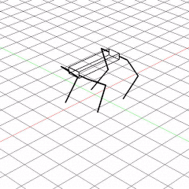

# Quadrupedal-Robot-Gait-Visualization


This repository uses the [OpenCV-3D-Renderer](https://github.com/zainkhan-afk/OpenCV-3D-Renderer) to create a quadrupedal robot gait visualization. Primitive shapes are used to create a robot in the rederer and then the robot legs are moved according to the gait selected. The gif below shows a sample trotting gait.


<p align="center">
  
</p>


## Robot

The robot has been modelled after the MiT Mini Cheetah. Each robot leg contains 3 joints and the legs are moved by specifying a point which the robot foot needs to reach in cartesian space. An Inverse Kinematics (IK) model of the robot leg takes in the desired robot foot position in cartesian space and calculates the joint positions require to move the foot to the required position.

The robot foot follows a half ellipse trajecotry. Each robot leg has a stance and flight period which is independent of all the other robot legs. The combined effect of all the individual leg stance and flight periods results in different kinds of gaits which can be seen below:  

### Trotting Gait

<p align="center">
  
</p>

### Galloping Gait

<p align="center">
  
</p>


### Walking Gait 1

<p align="center">
  
</p>

### Walking Gait 2

<p align="center">
  
</p>

Whole body IK model has been derived which allows for body movements without moving the robot legs.

<p align="center">
  
</p>


## Robot Gait Scheduler

The leg stance and flight periods can be changed manually using the gait scheduler GUI.

<p align="center">
  
</p>

The sliders can be moved for each leg to change the leg stance and flight timings. 

## Running the Repository

```
git clone --recurse-submodules https://github.com/zainkhan-afk/Quadrupedal-Robot-Gait-Visualization.git
```

Or

```
git clone https://github.com/zainkhan-afk/Quadrupedal-Robot-Gait-Visualization.git

git submodule update --init
```

To run the code

```
python main.py
```